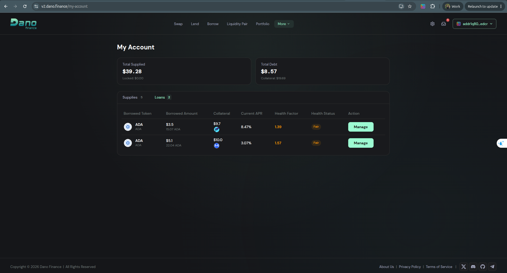
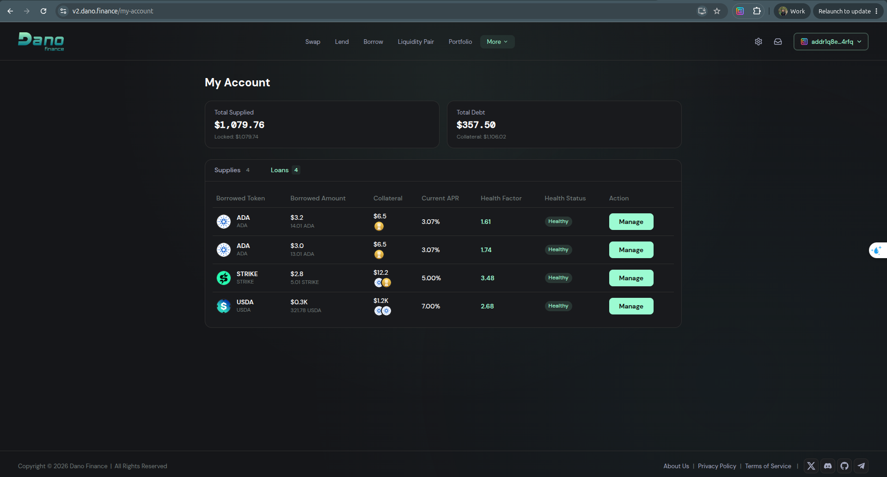

# The Four Approved User Journeys, and the State They Left in the Application

**Project** 1400107 · **Milestone 2** · Rolling Loan / "Refinance via Dano"

> *"I would like you to provide evidence demonstrating that the four approved user journeys (view,
> open, repay and refinance) were each successfully tested through the Eternl-connected front end,
> and provide the corresponding integration-test results."* — reviewer

This file answers that request in two parts. **§1** takes the four journeys one at a time, with the
user's path through the interface and the evidence behind each. **§2** shows what the transactions
left behind — the resulting loans in the application — and reconciles every figure on that screen
against the Cardano ledger.

The on-chain half of the evidence is in
[`05_ONCHAIN_TRANSACTIONS_AND_REPAY.md`](./05_ONCHAIN_TRANSACTIONS_AND_REPAY.md). The manual refinance journey,
step by step with screenshots, is in [`01_Integration_Test_Report_M2.md`](./01_Integration_Test_Report_M2.md) §1.

---

## 1. The four approved user journeys via Eternl

> *"I would like you to provide evidence demonstrating that the four approved user journeys (view,
> open, repay and refinance) were each successfully tested through the Eternl-connected front end,
> and provide the corresponding integration-test results."* — reviewer

### 1.1 The two classes of evidence

| Class | What it is | Who can check it |
|---|---|---|
| **E1 — captured in the interface** | The journey performed in the live app with the wallet connected, screenshotted and/or recorded. | **us** — we captured it |
| **E2 — On-chain settlement** | A Cardano mainnet transaction, publicly verifiable, accepted by live validators, carrying this application's own metadata under label 674. | **anyone**, from the chain |

E2 needs no cooperation from us. E1 does, and is marked as such wherever it appears. Where a journey
has no interface capture of its own, the cell says so rather than describing a screen — see §1.4.

### 1.2 The matrix

| Journey | E1 · Eternl front end | E2 · On-chain mainnet |
|---|---|---|
| **1. View** — see my loans, debt, collateral, health factor, APR | ✅ *My Account → Loans*, captured from the live app on two connected mainnet wallets — [§2.1](#21-the-two-screenshots) | ✅ every displayed borrowed amount reconciled to the ledger — [§2.4](#24-row-by-row-the-displayed-amount-is-the-ledger-amount) |
| **2. Open** — originate a loan against collateral | ✅ walkthrough through the connected front end; sheet capture not attached — §1.4 · ✅ *corroborating:* the originated loans are listed in the app and still open — §2.3 | ✅ **7 mainnet transactions of its own** — six *"Dano Finance: Borrow from Fluid"*, one *"Create Loan"* opening a Dano loan directly — [`05` §1.1](./05_ONCHAIN_TRANSACTIONS_AND_REPAY.md#11-the-transactions-that-opened-these-loans) · ✅ each mints that loan's position token and locks its collateral · ✅ **5 distinct Borrower NFTs** minted by the refinances — [`05` §2.1](./05_ONCHAIN_TRANSACTIONS_AND_REPAY.md#21-two-danogo-tokens-and-which-one-identifies-a-loan) |
| **3. Repay** — settle a loan | ✅ walkthrough through the connected front end; sheet capture not attached — §1.4 · ✅ *corroborating:* the settled loans are **absent** from the post-refinance screens — §2.5 · ✅ *corroborating:* **Fluid's own dashboard marks them `REPAID`** — [`05` §5.3](./05_ONCHAIN_TRANSACTIONS_AND_REPAY.md#53-fluids-own-records-say-the-loans-are-repaid) | ✅ **3 mainnet transactions of its own**, debt paid from the borrower's own funds — `17c23dde…`, `ea823365…`, and **`77748bd9…` on Danogo's own `Repay Loan` path**, which burns the borrower's title to the loan — [`05` §5.5–§5.6](./05_ONCHAIN_TRANSACTIONS_AND_REPAY.md#55-repaying-an-external-loan-on-mainnet-two-transactions) · ✅ **5 Fluid loans repaid in full** as the settlement leg of a refinance · ✅ the counterparty's own indexer reports **seven** loans `loan_repaid`, `remainingDebt: 0` |
| **4. Refinance** — roll a Fluid loan into a Dano loan | ✅ **full walkthrough**: refinance card and preview → **Eternl signing dialog with inputs and outputs** → confirmation → portfolio after, screenshotted end-to-end — [`01` §1](./01_Integration_Test_Report_M2.md) · ✅ demo video https://youtu.be/z07TxLJLC2w · the **resulting** Dano loans shown in the app — §2 | ✅ **5 signed mainnet refinances**, 2 wallets, 3 collateral assets, 2 borrowed assets, 9 days — [`05` §1](./05_ONCHAIN_TRANSACTIONS_AND_REPAY.md#1-the-five-refinance-transactions) |

### 1.3 The user path for each journey

Described as the *user's* path, because that is what is being evaluated — not the code path.

**Journey 1 — View**

```
  Open v3.danogo.io  →  Connect Wallet  →  Eternl  →  approve
      →  Portfolio                    : all positions, allocation %, borrow rows in negative tone
      →  My Account → Loans           : one row per open loan, per protocol
      →  Manage                       : Loan Details popup — debt, collateral list, APR,
                                        health factor with band label, utilisation
```

Nothing is signed. The user reads their real on-chain position. It is the journey where a wrong
number is most damaging and least visible, which is why §2.4 reconciles it figure by figure against
the ledger rather than merely screenshotting it.

**Journey 2 — Open**

```
  Borrow Market  →  pick a market  →  Borrow
      →  choose collateral, enter amount
      →  preview: max borrow, projected health factor, origination fee, loan impact
      →  Confirm  →  Eternl signature prompt  →  submit  →  confirmation + tx hash
```

On-chain this journey locks the collateral and mints the loan's position token. It ran **seven**
times on mainnet in its own right — six times against Fluid and once directly against a Dano pool —
and additionally as the second leg of each refinance. See
[`05` §1.1](./05_ONCHAIN_TRANSACTIONS_AND_REPAY.md#11-the-transactions-that-opened-these-loans).

**Journey 3 — Repay**

```
  My Account → Loans  →  Manage  →  Repay
      →  amount pre-fills to min(wallet balance, full repayment)
      →  preview: new debt, new health factor, "↘ Repaid" badge on full repayment
      →  Confirm  →  Eternl signature prompt  →  submit  →  confirmation
```

Protocol-specific rules are enforced and tested: Surf allows full repayment only and disables the
CTA with a named reason when the wallet cannot cover it; Fluid enforces recast rules and rejects a
repayment that does not reduce principal; Liqwid offers the receive-as-underlying toggle. This
journey ran three times on mainnet in its own right — twice against Fluid and once against Danogo's
own contracts — and additionally as the settlement leg of each refinance. See
[`05` §5](./05_ONCHAIN_TRANSACTIONS_AND_REPAY.md#5-the-repay-journey-in-all-three-of-its-forms).

**Journey 4 — Refinance**

```
  My Account → Loans  →  a Fluid loan row shows "Dano save 4.56% net cost"
      →  Manage  →  Loan Details  →  Refinance via Dano  (card expands in place)
      →  preview: Net cost (Fluid → Dano) 4.00% → −0.56%
                  Health Factor 1.77 Healthy → 1.52 Fair
                  Fee 2 ADA
                  ✓ Same loan, Same collateral
                  "You don't need extra funds to close your Fluid loan."
      →  Confirm  →  Eternl shows ONE transaction, labelled "Dano Finance: Create Loan"
      →  sign  →  "Transaction confirmed" + hash
      →  Portfolio: the Fluid position is gone; a Dano position stands in its place
```

The preview numbers above are from the journey that produced tx `c426d9fa…`. On-chain, that
transaction settled 12.000102 ADA of Fluid debt and paid exactly 2.000000 ADA of origination fee,
carrying DJED 6.000000 across. **The number the user was shown is the number that settled** — which
is the concrete form of "no data mismatch". Step by step, with screenshots, in [`01_Integration_Test_Report_M2.md`](./01_Integration_Test_Report_M2.md) §1.

### 1.4 The scope of these claims

Stated explicitly, so the reviewer does not have to work out where each claim stops:

1. **What the walkthroughs establish — and what they do not.** Every journey was walked end-to-end
   through the Eternl-connected front end during this milestone, and the open, repay and refinance
   sessions settled on mainnet fifteen times from two separate wallets. The previous submission's
   row *"Tester completed the flow without external guidance ✅ Yes"* was a self-assessment; this
   file does not carry it as a verdict, and instead reports the user path and the evidence for each
   journey, which the reviewer can check directly. See
   [`08_CORRECTIONS.md`](./08_CORRECTIONS.md) C‑2.
2. **Interface captures.** The refinance journey is captured end-to-end — loan row → refinance card
   → Eternl signing dialog with inputs and outputs → confirmation → portfolio after
   ([`01` §1](./01_Integration_Test_Report_M2.md)), and the demo video walks the same flow
   (https://youtu.be/z07TxLJLC2w). The *open* and *repay* journeys are carried by their own mainnet
   transactions and by the resulting state in the app (§2); the sheet captures can be added if the
   reviewer wants them.
3. **Journeys are not double-counted.** Five transactions each perform a repay *and* a refinance.
   That is five refinances and five settlement legs, not ten demonstrations. The three separately
   evidenced repayments are `17c23dde…`, `ea823365…` and `77748bd9…`; the seven separately
   evidenced originations are in
   [`05` §1.1](./05_ONCHAIN_TRANSACTIONS_AND_REPAY.md#11-the-transactions-that-opened-these-loans).
4. **"View" has no transaction by nature** — reading a position does not produce one. Its evidence
   is §2, where every displayed figure is re-derived from the ledger.
5. **On the word "Eternl":** the chain records that a wallet's key authorised each transaction, not
   which wallet software requested the signature. The Eternl signing dialog is directly visible in
   [`screenshots/03-eternl-inputs-outputs.png`](./screenshots/03-eternl-inputs-outputs.png) for the
   refinance journey. For the other journeys, "through the Eternl-connected front end" is our
   statement about how they were performed, and we mark it as ours rather than as something the
   ledger proves.
6. **The automated-test figures in [`01_Integration_Test_Report_M2.md`](./01_Integration_Test_Report_M2.md) §3 are our own reporting**, not
   third-party-checkable evidence. They are reported because the milestone asks for
   integration-test results; the load-bearing evidence is the ledger and Fluid's own records.

---

---

## 2. The post-refinance state in the app, reconciled to the ledger

[`05_ONCHAIN_TRANSACTIONS_AND_REPAY.md`](./05_ONCHAIN_TRANSACTIONS_AND_REPAY.md) proves what the five transactions **did**. This section
proves what they **left behind**, and that the numbers the application shows a user today are the
numbers the Cardano ledger actually holds. A transaction hash shows that a validator accepted
something; it does not show that the borrower can then open the app, see their loan, and recognise
it as theirs.

Everything below is read from the public **Koios API**, as **live** state rather than as history —
so the loans age: the principal is fixed, the accrued interest grows.

### 2.1 The two screenshots

Captured on **2026‑09‑10** from the deployed application, with each wallet connected through the
CIP‑30 browser extension. Both are unedited full-window captures — address bar included, nothing
removed. Every figure reconciled in §2.4 is read from the **Cardano ledger**, not from the
application, so the reconciliation does not depend on which host served the page.

| Screenshot | Wallet shown in the app | Loans listed |
|---|---|---|
| [`my-account-loans-W1`](./screenshots/screens/my-account-loans-W1-addr1q80xx.png) | `addr1q80…edcr` | **2** |
| [`my-account-loans-W2`](./screenshots/screens/my-account-loans-W2-addr1q8ex.png) | `addr1q8e…4rfq` | **4** |





### 2.2 The wallets in the screenshots are the wallets that signed

The truncated addresses in the app's header expand to the two addresses that appear as signers in
the five mainnet transactions:

| | Address, in full | Signed |
|---|---|---|
| **W1** | `addr1q8009gf2f66x5nnk3xd7f3kagn3avqtyhk5uf4zhnejmjrw7lqahdkjjknfuxdj9kevvyqmlu3zyx3x547dqw2pevx0scdedcr` | TX‑01, TX‑02 |
| **W2** | `addr1q8epy5jaharr0857d0lcwhlyg7tnarlajcml084mlhv92h39xk00fdnqnawyvkcs43kmt7hv4uqwetw9yd6lkjl5vxhs4p4rfq` | TX‑03, TX‑04, TX‑05 |

Both are visible on Cardanoscan against the transactions in
[`05` §1](./05_ONCHAIN_TRANSACTIONS_AND_REPAY.md#1-the-five-refinance-transactions).

### 2.3 How the application knows which loans to show

Each refinance transaction mints **two** tokens under the Danogo policy
`aca8e306eda3eb6c25a838bebac37d929c216aab13c8d463fca5a08d`:

- one that stays in the **Dano loan contract** — a **recurring marker** for loan UTxOs in that
  contract, which is *not* unique to one loan (`asset1pr26rn8r…` has 57 mints and 49 burns, and is
  the same token in three of the five refinances), and
- one that is paid **to the borrower's own wallet** — unique, one mint, no burn while the loan is
  open.

The distinction matters, and our previous submission did not draw it — see
[`05` §2.1](./05_ONCHAIN_TRANSACTIONS_AND_REPAY.md#21-two-danogo-tokens-and-which-one-identifies-a-loan)
and [`08_CORRECTIONS.md`](./08_CORRECTIONS.md) C‑3.

The second is the borrower's title to the loan. Danogo's own CIP‑25 metadata under the same policy
names it, verbatim:

> **`"name": "Borrower NFT (Flexible Pool Lending)"`**
> **`"description": "An NFT representing the loan from the Danogo Flexible Pool Lending"`**

So the "Loans" list is not a report the backend composes at will. It is the set of Borrower NFTs the
connected wallet holds — a count held on chain, not in our database, and countable by anyone.

| Wallet | Borrower NFTs held on chain | "Loans" badge in the screenshot | |
|---|---|---|---|
| W1 | 2 | **2** | ✅ |
| W2 | 4 | **4** | ✅ |

### 2.4 Row by row: the displayed amount is the ledger amount

The principal is what the Dano liquidity source disbursed on chain; the accrual is simple interest
at **the APR the application itself displays in that row**; the result is truncated to two decimals,
which is the display rule the application follows across all five rows.

**Wallet W1**

| UI row | Borrowed (displayed) | APR (displayed) | Created by | Principal on chain | Age at capture | Principal + accrual | |
|---|---|---|---|---|---|---|---|
| 1 | 15.07 ADA | 8.47% | [`d240fab1…`](https://cardanoscan.io/transaction/d240fab1d260b8553a60bf5bae7eb4a1500f9011446a5f01a3c156d6f0dad84c) | 15.015024 ADA | 16.8 d | 15.0736 → **15.07** | ✅ |
| 2 | 22.04 ADA | 3.07% | [`88579a30…`](https://cardanoscan.io/transaction/88579a30a7c11bea37e8483af75b3c4ed56845f1b1378f0e0ed8c3aa81146652) | 22.000857 ADA | 21.8 d | 22.0413 → **22.04** | ✅ |

**Wallet W2**

| UI row | Borrowed (displayed) | APR (displayed) | Created by | Principal on chain | Age at capture | Principal + accrual | |
|---|---|---|---|---|---|---|---|
| 1 | 14.01 ADA | 3.07% | [`c426d9fa…`](https://cardanoscan.io/transaction/c426d9fa4bb213e95efe7bdef96ccc4d9a97b89f750527b1375608d89cd25c8c) | 14.000108 ADA | 15.6 d | 14.0185 → **14.01** | ✅ |
| 2 | 13.01 ADA | 3.07% | [`1cf8f08b…`](https://cardanoscan.io/transaction/1cf8f08b65574186d4d53c6288e848207b1bda42040e1a97e519839c57549f10) | 13.000010 ADA | 15.9 d | 13.0174 → **13.01** | ✅ |
| 3 | 5.01 **STRIKE** | 5.00% | [`0e26cc58…`](https://cardanoscan.io/transaction/0e26cc585890eeb13c9bc1e4a37f752eaf770abaf72f8fbde199cf13908b05b8) | 5.000560 STRIKE | 13.9 d | 5.0101 → **5.01** | ✅ |
| 4 | 321.78 USDA | 7.00% | `67833d58…`, 2025‑10‑12 | — | 333 d | **not part of this milestone** | — |

Five rows, five transactions, five matches — including the non-ADA one. The values were not chosen
to fit: the principals are odd numbers produced by min-UTxO arithmetic (`22.000857`, `15.015024`,
`13.000010`), and each still lands on the displayed figure once its own APR and its own age are
applied.

**About W2's fourth loan.** W2 holds four Borrower NFTs, so the app correctly shows four. The fourth
is the **USDA** loan, minted on **2025‑10‑12** by transaction
`67833d580982a9be309fa322d81951acd8c4c82166e676cbde88c1478e60099a` — almost a year before this
milestone's work. It is **not** offered as evidence for anything here and is not reconciled above.
It is named only so the count adds up without a gap.

### 2.5 What is *absent* from the screenshots, and why that is the point

Neither account lists a **Fluid** loan. That is not a rendering choice — those loans no longer exist
anywhere on Cardano. Fluid mints a position NFT when a loan opens;
[`05` §2](./05_ONCHAIN_TRANSACTIONS_AND_REPAY.md#2-facts-that-hold-for-all-five-transactions) shows all
five being burned inside the refinance transactions. The consequence, today:

| Refinance tx | Fluid position NFT | Total supply on chain, now |
|---|---|---|
| `88579a30…` | `asset128rrfu48vwdclrdxe4hxqhq6hnd5q4h8glf7uq` | **0** |
| `d240fab1…` | `asset12nvvpmrv0qmeh9dz4xcnvx85lknrrzy9rh7uha` | **0** |
| `1cf8f08b…` | `asset1zxnfclhy8tfde90aduttcpp20c7s8r67slv9vr` | **0** |
| `c426d9fa…` | `asset16hjjsk7mzedy20a27aqe5etg0a6v3g7cdlglac` | **0** |
| `0e26cc58…` | `asset1hc8hc7kt4ksrx2ww55gw7l7g9kznsas6csadwx` | **0** |

A supply of zero is a stronger statement than a burn in a historical transaction: the token has not
reappeared, in any wallet, in any UTxO, since. This is the **repay** journey seen from the user's
side — the debt the borrower had before is not there afterwards, and the replacement debt is listed
with the right number against it.

### 2.6 What this section does not claim

- **What the screenshots are.** They were captured by us, from wallets we control, and they evidence
  the *view* journey and the state of the chain: the loans listed, and every displayed amount
  reconciled to the ledger. They are reported as that, and the scope note is in §1.4.1 and
  [`08_CORRECTIONS.md`](./08_CORRECTIONS.md) C‑2.
- **The borrowed amounts are reconciled, not the USD figures.** The dollar values in the screenshots
  are oracle-priced at render time and cannot be derived from a transaction hash. The native-unit
  amounts can, and those are what §2.4 checks.
- **Collateral is stated from the origination transaction, not the current UTxO.** A loan's
  collateral can be modified after it is opened.
- **W2's fourth loan predates this milestone** and is excluded from every count and claim above.

### 2.7 What this section rests on

Four claims, all read from `api.koios.rest`:

| Claim | Source |
|---|---|
| The Fluid loan position NFT burned by each refinance has **total supply 0** today | asset supply, live |
| The Dano Borrower NFT minted by each refinance is **still held by the signing wallet** | the wallet's current assets |
| The number of Borrower NFTs each wallet holds equals the **"Loans N"** badge in its screenshot | the wallet's current assets |
| The amount the application **displayed** equals the on-chain principal plus simple interest at the APR the application displayed, truncated to 2 dp | the principals in [`05` §3](./05_ONCHAIN_TRANSACTIONS_AND_REPAY.md#3-per-transaction-value-flow) and each transaction's timestamp |

The Fluid policy id used for the supply figures is the one read out of the burn records in the
transactions themselves, not a constant carried in from elsewhere.

---
